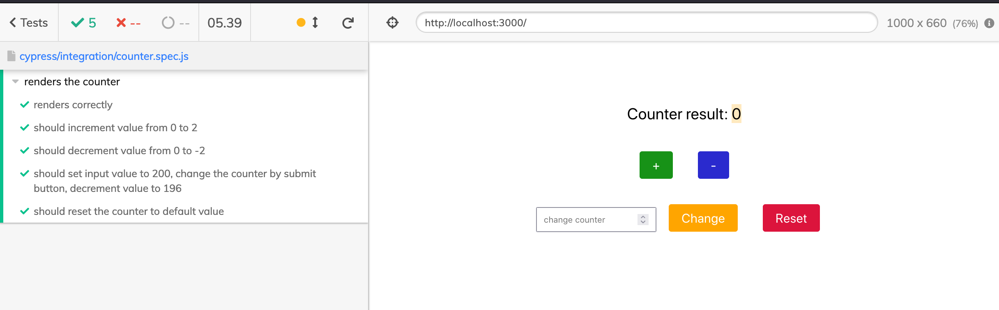
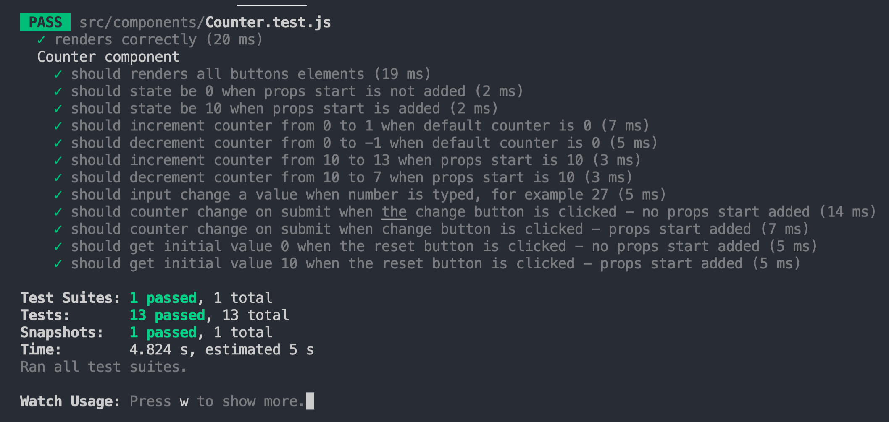

# Counter Testing

## Preview site :arrow_right: [tap here](https://szymonrojek.github.io/counter-testing/)

## Available tests:

**Snapshot**

- check the [file](https://github.com/SzymonRojek/counter-testing/blob/main/src/components/__snapshots__/Counter.test.js.snap)

**Enzyme:** npm run test and then press "a" to run all tests

- check the [file](https://github.com/SzymonRojek/counter-testing/blob/main/src/components/Counter.test.js)

**Cypress:** npm run cypress

- check the [file](https://github.com/SzymonRojek/counter-testing/blob/main/cypress/integration/counter.spec.js)

The main concept is to check:

- if the initial state of the component is 0, if yes then I don't have to pass the prop start
- the initial state of the component is 10, when the prop start is equal to 10
- the component has got addition button and substraction button
- if after the click event the state is changed
- if after entering a number in the text field and pressing the "Change button" - is the state changed
- if the reset button is changing the state

## Cypress test result:

### GIF

 
 

 
 

## Enzyme test result:

 
 

 
 

## Available Scripts

In the project directory, you can run:

### `npm start`

Runs the app in the development mode.\
Open [http://localhost:3000](http://localhost:3000) to view it in the browser.

The page will reload if you make edits.\
You will also see any lint errors in the console.

### `npm run build`

Builds the app for production to the `build` folder.\
It correctly bundles React in production mode and optimizes the build for the best performance.

The build is minified and the filenames include the hashes.\
Your app is ready to be deployed!

See the section about [deployment](https://facebook.github.io/create-react-app/docs/deployment) for more information.

### `npm run eject`

**Note: this is a one-way operation. Once you `eject`, you can’t go back!**

If you aren’t satisfied with the build tool and configuration choices, you can `eject` at any time. This command will remove the single build dependency from your project.

Instead, it will copy all the configuration files and the transitive dependencies (webpack, Babel, ESLint, etc) right into your project so you have full control over them. All of the commands except `eject` will still work, but they will point to the copied scripts so you can tweak them. At this point you’re on your own.

You don’t have to ever use `eject`. The curated feature set is suitable for small and middle deployments, and you shouldn’t feel obligated to use this feature. However we understand that this tool wouldn’t be useful if you couldn’t customize it when you are ready for it.

This project was bootstrapped with [Create React App](https://github.com/facebook/create-react-app).
